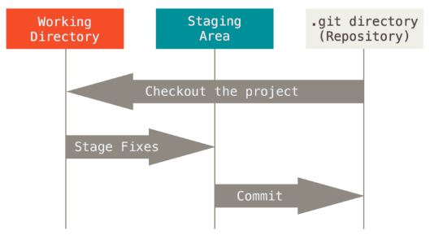
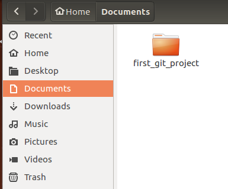
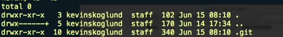
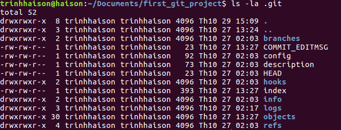
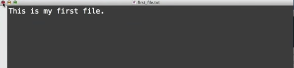
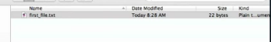
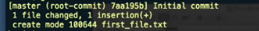

Git basic commands
==================
#### 1. **The Three States**  

Git has three main states that your files can reside in: committed, modified and staged.  
* Committed means that your data is safely saved in your local database.
* Modified means that you have changed your file but haven't committed it to your database yet.
* Staged means that you have marked a modified file in its current version to go into your next commit snapshots

This leads us to the three main sections of a Git project: the Git directory, the working directory and the staging area

The Git directory is where Git store the metadata and object database for your project. This is the most important part of Git and it is what copied when you clone a repository from another project.  
The working directory is a single checkout of a version of the project. These files are pulled out of the compressed database in the Git directory and place on your dish to be used or modified.  
The staging area is a file, generally contained in your Git directory. That stores information about what will go into your next commit.
#### 2. **Initialize Git**

To initialize Git on Linux, we open the terminal and type command `$ apt-get install git`

Once you get Git installed, the next step is to initialize Git in the project or tell Git to start tracking things in Git project.
For example, inside the Documents folder, I create a new folder named first_git_project

First, I go to first_git_project

`$ cd Documents/first_git_project`

Then I initialize Git in this folder

`$ git init`

This command'll help Git set up first_git_project as the home base and allow Git to track all file change inside it. Now I want to see all files inside this folder

`$ ls -la`

That shows me the .git folder that was created by the initialize command and is the directory where Git stores all of the tracking information or Git's workspace. It's no matter how deep down other folders that we got files going on, they're always stored at the top level of our project, inside this .git directory. If you want to remove git from our project, you just have to remove .git directory. Let take a look insie .git directory

#### 2. **Getting started**

Inside directory first_git_project, I'll create a new text file

Now, I want to tell Git to add all changes that've been made to entire project

`$ git add .`

Then I commit that change which means telling git to put it in permanent memory

`$ git commit -m "Initial commit"`

So those are the basic process we're going to follow:

* Make changes
* Add the changes
* commit the changes to the repository with a message

> ##### Note: there are some best practices for a commit message
>
> * Short single-line summery (less than 50 characters)
> * Optionally followed by a blank line and a more complete description
> * Keep each line to less than 72 characters
> * Write commit messages in present tense, not past tense
> * Bullet points are usually asterisks or hyphens
> * Can add "ticket tracking numbers" from bugs or support requests
> * Can develope shorthand for your organization

#### 3. Viewing the commit log
To show the commit messages, we use this command

`$ git log`
