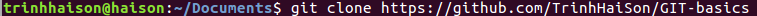
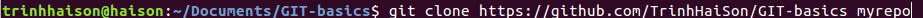
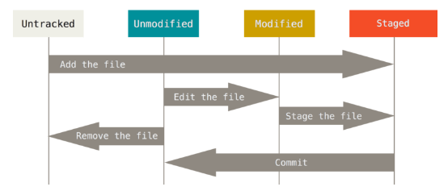
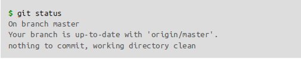
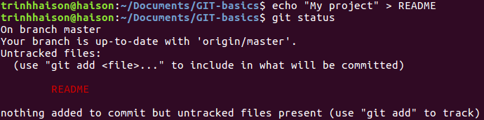

Recording changes to the repository
==================
#### 1. **Cloning an existing repository**

If you want to copy of an existing directory, the command you need is 'git clone'. Take a note that there is another command is 'git checkout'
and the difference between them is that while 'git checkout' allow you to get just a working copy, 'git clone' give you a full copy
of nearly full data that the server has. Every version of every file for the history of the project is pulled down by defaul when you
run 'git clone'.  
Example:   
That creates a directory named Git-basics and, initializes a .git directory inside it, pulls down all the data for that directory and check out a working copy of the lastest version. If you want to clone the repository into a directory named somthing other than 'Git-basics', you can specify that as the next command-line option: 
  
Git uses a number of different protocols. The previous example uses https:// protocol but you can also see git:// or user@server:path/to/repo.git, which uses the SSH transfer protocol.

#### 2. **Tracked and Untracked**

Each file in your working directory can be in one of two states: tracked or untracked. Tracked files are files in the last snapshot. They can be unmodified, modified or staged. Untracked files are everything else - any files in your working directory that was not in the last snapshot and are not in the staging area. When you first clone a directory, every files in it is tracked and unmodified because Git checked them out and you haven't editted anything.  
  

#### 3. **Checking the status for your file**

The main tool you use to check which file is in which state is 'git status' command. If you run that command directly right after a clone you'll see something like this:  
  
This means that you have a clean directory - in other word, there are no untracked and modified files.  
Now, you add a new file to your project, suppose that a file named README, then run the 'git status' c:  
  

You  can  see  that  your  new  README  file  is  untracked,  because  it’s  under  the
“Untracked  files”  heading  in  your  status  output.  Untracked  basically  meansthat Git sees a file you didn’t have in the previous snapshot (commit); Git won’t start including it in your commit snapshots until you explicitly tell it to do so. It
does  this  so  you  don’t  accidentally  begin  including  generated  binary  files  orother files that you did not mean to include. You do want to start including RE-ADME, so let’s start tracking the file.
